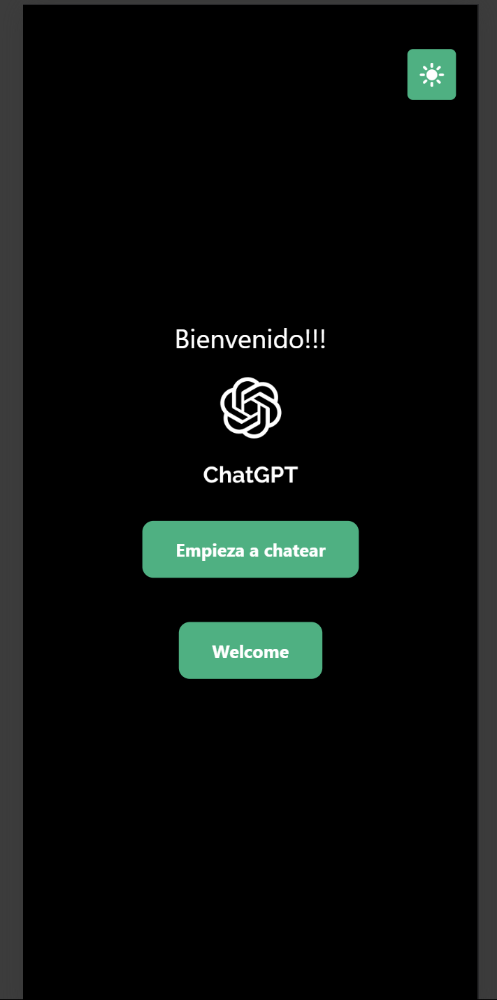
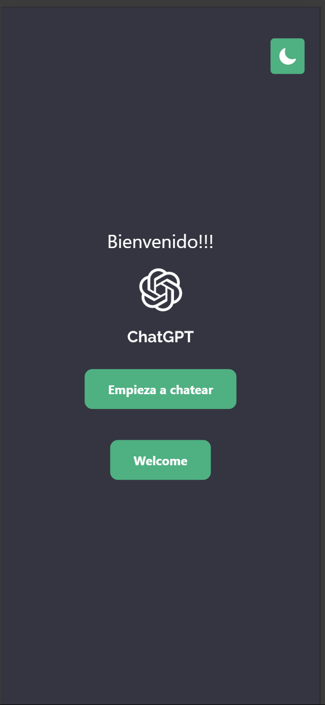
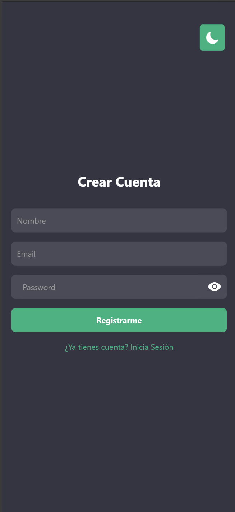
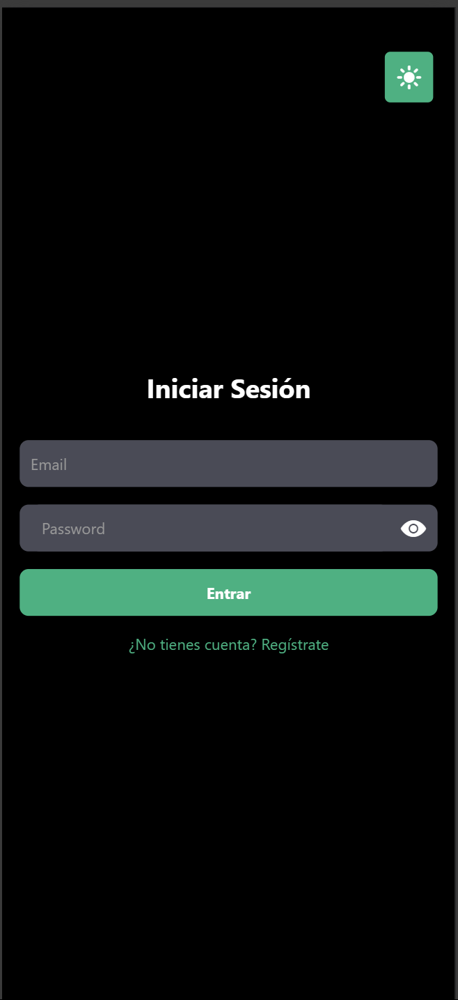
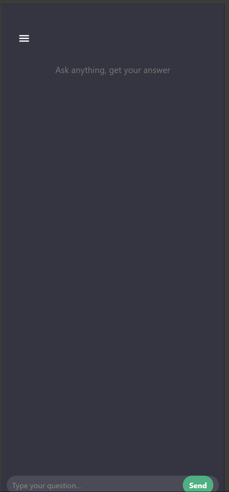
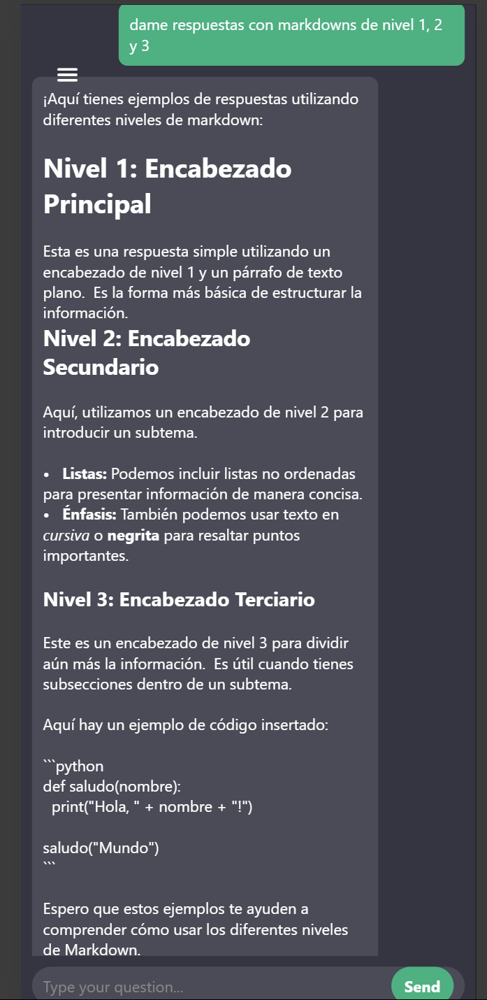
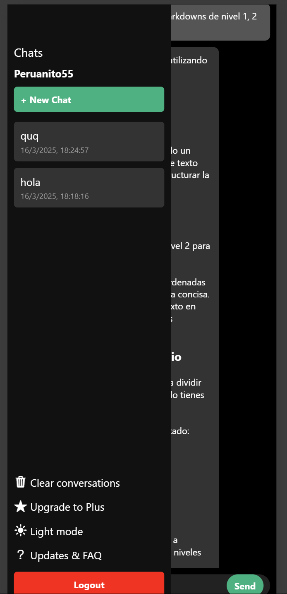

# README del Proyecto

Este proyecto es una aplicación construida con **React Native** y **Expo Router**, que integra autenticación con Firebase. A continuación, se describen los archivos principales y la funcionalidad de cada uno:

---

## Descripción de Archivos

### 1. `DarkModeContext.tsx`
- **Ubicación**: `../context/DarkModeContext.tsx`
- **Descripción**:  
  Provee el contexto global para manejar el **modo oscuro** en la aplicación. Utiliza AsyncStorage para persistir la preferencia de tema (oscuro o claro) en el dispositivo del usuario.
- **Uso Principal**:  
  - Contiene un `DarkModeProvider` que envuelve toda la app.  
  - Expone la propiedad `isDarkMode` y la función `toggleDarkMode` para alternar entre modo oscuro y modo claro.

  

  


---

### 2. `_layout.tsx`
- **Ubicación**: `../pages/_layout.tsx`
- **Descripción**:  
  Define la estructura principal de navegación con **Expo Router**. En este caso, renderiza un `Stack` con las diferentes pantallas:
  - `splashscreenchat`
  - `splashscreenwelcome`
  - `index`
  - `welcome`
  - `chat`
  - `AuthScreen`
  - `upgradeplus`
- **Uso Principal**:
  - Envuelve todas las pantallas con `DarkModeProvider` para que el modo oscuro esté disponible en cada vista.
  - Configura las opciones de la cabecera (`headerShown: false`) para la mayoría de pantallas.

---

### 3. `AuthScreen.tsx`
- **Ubicación**: `../pages/AuthScreen.tsx`
- **Descripción**:  
  Pantalla de **autenticación** de usuarios. Permite:
  - Crear cuenta (registro) con correo y contraseña.
  - Iniciar sesión si ya existe el usuario.
  - Manejo de estado para mostrar nombre de usuario, email y contraseña.
  - Validación básica del formato de correo (solo dominios `.com` o `.co`).
  - Si el usuario está autenticado, redirige automáticamente a la pantalla de chat.
- **Puntos Clave**:
  - Usa los métodos de Firebase Authentication (`createUserWithEmailAndPassword`, `signInWithEmailAndPassword`) para gestionar el acceso.
  - Permite mostrar/ocultar la contraseña con un ícono de ojo (`Ionicons`).
  - Incluye modo oscuro usando el contexto `DarkModeContext`.

  

  

---

### 4. `chat.tsx`
- **Ubicación**: `../pages/chat.tsx`
- **Descripción**:  
  Pantalla principal de **chat**. Implementa:
  - Lista de conversaciones (sesiones de chat) guardadas en Firebase Firestore.
  - Envío y recepción de mensajes, con su correspondiente guardado en Firestore.
  - Uso de un placeholder de API para la respuesta del “asistente” 
  - Menú lateral para:
    - Crear nueva sesión de chat.
    - Borrar todas las conversaciones.
    - Cambiar a modo oscuro.
    - Cerrar sesión (logout).
    - Ir a la pantalla de **Upgrade Plus**.
- **Puntos Clave**:
  - Almacena cada sesión de chat en la colección `chatSessions` y los mensajes en subcolecciones `messages` dentro de cada sesión.
  - Auto-scroll al final de la lista de mensajes con un `ScrollView` y `scrollToEnd`.
  - Incluye un botón tipo “hamburguesa” (ícono de menú) para abrir/cerrar el menú lateral.

  

  

  

---

### 5. `index.tsx`
- **Ubicación**: `../pages/index.tsx`
- **Descripción**:  
  Pantalla de inicio de la app (Home). Muestra:
  - Botón para cambiar a modo oscuro.
  - Mensaje de bienvenida (“Bienvenido!!!”).
  - Un logotipo localizado en `../assets/images/logo.png`.
  - Botones para:
    - Navegar a la pantalla de chat (`splashscreenchat`).
    - Navegar a la pantalla de bienvenida (`splashscreenwelcome`).
- **Uso Principal**:
  - Sirve como punto de partida desde donde el usuario decide si ir al chat o a la sección "Welcome".

---

### 6. `splashscreenchat.tsx`
- **Ubicación**: `../pages/splashscreenchat.tsx`
- **Descripción**:  
  Pantalla de **splash** previa al chat. Muestra brevemente el logotipo y luego redirige a `chat.tsx` después de 2 segundos.
- **Uso Principal**:
  - Transición inicial para mejorar la experiencia de usuario antes de cargar el chat.

---

### 7. `splashscreenwelcome.tsx`
- **Ubicación**: `../pages/splashscreenwelcome.tsx`
- **Descripción**:  
  Pantalla de **splash** previa a la sección “Welcome”. Similar a la anterior, muestra un logotipo y redirige a `welcome.tsx` tras 2 segundos.
- **Uso Principal**:
  - Dar una breve transición o animación inicial para la experiencia de bienvenida.

---

### 8. `welcome.tsx`
- **Ubicación**: `../pages/welcome.tsx`
- **Descripción**:  
  Pantalla de tipo **introducción** con desplazamiento horizontal para mostrar diferentes “tarjetas” de:
  - **Examples**
  - **Capabilities**
  - **Limitations**
- **Uso Principal**:
  - El usuario puede navegar horizontalmente para leer cada sección.
  - Al terminar, se muestra un botón para redirigir finalmente al chat.
  - Incluye nuevamente la lógica de modo oscuro.

---

### 9. `upgradeplus.tsx`
- **Ubicación**: `../pages/upgradeplus.tsx`
- **Descripción**:
  Pantalla informativa sobre **planes de suscripción** (Plus y Pro).  
  Muestra precios, características y un botón para seleccionar cada plan.
- **Uso Principal**:
  - Permite ilustrar diferentes planes de pago al usuario (ejemplo ficticio).
  - Integra el modo oscuro para mantener coherencia visual.

---

## Requisitos Previos

- **Node.js** y **npm** o **yarn** instalados.
- **Expo CLI** instalado globalmente (opcional, pero recomendado).
- Cuenta y configuración de **Firebase** en ../utils/`FirebaseConfig.ts` o similar que exporta las constantes `auth` y `db`

---

## Instalación y Ejecución

1. **Clonar** este repositorio o descargar los archivos.
2. Instalar dependencias:
   ```bash
   npm install
   # o
   yarn install
   ```
3. Configurar Firebase:
   - Editar o crear el archivo `FirebaseConfig.ts` dentro de `utils/`.
   - Asegurarse de exportar `db` y `auth` basados en los métodos de Firebase.
4. Ejecutar la app en modo desarrollo:
   ```bash
   npx expo start
   ```
   Después, escanear el código QR en un dispositivo móvil o iniciar un emulador/simulador.

---

## Uso de la Aplicación

- **Registro e Inicio de Sesión**:  
  Acceder a `AuthScreen.tsx`, introducir email y contraseña válidos.  
- **Chat**:  
  - Tras autenticarse, la app redirige al Chat.  
  - Crear nuevas sesiones de chat.  
  - Borrar conversaciones, cambiar de tema, salir de la sesión, etc.  
- **Pantallas de Bienvenida y Splash**:  
  - Muestran animaciones o transiciones temporales antes de cargar la pantalla principal.  
- **Upgrade Plus**:  
  - Sección informativa sobre planes de suscripción.  

---

## Personalización

- **Colores y estilos**:  
  - Se manejan principalmente en cada archivo a través de `StyleSheet`.  
  - Para cambiar colores globales (fondo, textos), usar `DarkModeContext` o editar las propiedades en cada estilo.
- **Tiempo de Splash**:  
  - Ajustar los `setTimeout` en `splashscreenchat.tsx` y `splashscreenwelcome.tsx` si se requiere cambiar la duración de la transición.

---

## Créditos

- **React Native & Expo** para el desarrollo móvil.
- **Firebase** para la autenticación y base de datos en la nube.
- Íconos de **Ionicons** para algunos botones.
- Lógica de modo oscuro inspirada en prácticas comunes de React Context + AsyncStorage.

---

## Licencia

Juan Pablo Restrepo Coca
---

¡Gracias por usar esta aplicación! Esperamos que esta guía ayude a comprender la estructura y a modificar el proyecto según tus necesidades. Si tienes preguntas o mejoras, no dudes en contribuir o enviar tus comentarios.